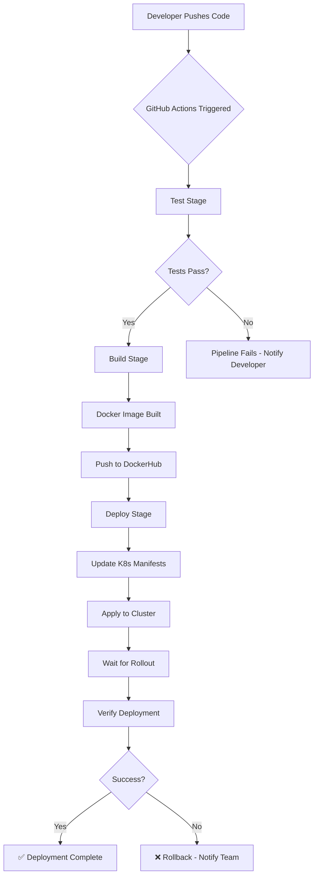

# CI/CD Pipeline Summary

## ✅ What Has Been Set Up

### 1. Complete GitHub Actions CI/CD Pipeline
- **Location**: `.github/workflows/ci-cd.yml`
- **Features**:
  - Automated testing on every push/PR
  - Docker image building with commit SHA tagging
  - Automatic deployment to Kubernetes
  - Health checks and rollout verification

### 2. Kubernetes Configuration
**Location**: `k8s/` directory

#### Files Created:
- **namespace.yaml**: Creates isolated `flask-app` namespace
- **deployment.yaml**: 
  - 3 replicas for high availability
  - Resource limits (CPU/Memory)
  - Liveness and readiness probes
  - Automatic rolling updates
- **service.yaml**: 
  - LoadBalancer service for external access
  - Port mapping: 80 → 5000

### 3. Automated Testing
- **Location**: `tests/test_app.py`
- **Tests**:
  - Home endpoint test
  - Response type validation
- **Coverage**: pytest with coverage reporting

### 4. Docker Configuration
- **Dockerfile**: Optimized Python 3.10 image
- **.dockerignore**: Excludes unnecessary files from build

### 5. Documentation
- **README.md**: Comprehensive guide with architecture, troubleshooting, and advanced features
- **QUICKSTART.md**: 5-minute quick start guide
- **SETUP_SUMMARY.md**: This file

---

## 🎯 Pipeline Workflow



---

## 📦 Pipeline Stages Explained

### Stage 1: Test (Runs on EVERY push/PR)
```yaml
✓ Checkout code
✓ Set up Python 3.10
✓ Install dependencies (Flask, pytest, pytest-cov)
✓ Run pytest with coverage
✓ Upload coverage report to Codecov
```

### Stage 2: Build & Push (ONLY on main branch push)
```yaml
✓ Login to DockerHub using secrets
✓ Build Docker image tagged with commit SHA
✓ Tag as 'latest'
✓ Push both tags to DockerHub
```

### Stage 3: Deploy (ONLY on main branch push)
```yaml
✓ Install kubectl
✓ Configure kubeconfig from secret
✓ Create/update namespace
✓ Update deployment.yaml with new image tag
✓ Apply all Kubernetes manifests
✓ Wait for rollout (5 min timeout)
✓ Verify deployment status
```

---

## 🔐 Required GitHub Secrets

You MUST configure these in GitHub → Settings → Secrets and variables → Actions:

| Secret | Description | How to Get |
|--------|-------------|------------|
| `DOCKER_USERNAME` | Your DockerHub username | Sign up at hub.docker.com |
| `DOCKER_PASSWORD` | DockerHub password/token | Use access token for security |
| `KUBECONFIG` | Kubernetes config (base64) | See commands below |

### Getting KUBECONFIG:

**Windows PowerShell:**
```powershell
# For Minikube
$kubeconfig = Get-Content "$HOME\.kube\config" -Raw
[Convert]::ToBase64String([Text.Encoding]::UTF8.GetBytes($kubeconfig))
```

**Git Bash / WSL:**
```bash
cat ~/.kube/config | base64 -w 0
```

Copy the output and paste as the secret value.

---

## 🚀 How to Use

### Quick Start (5 minutes):

1. **Start Kubernetes cluster:**
   ```powershell
   minikube start
   minikube tunnel  # Keep running
   ```

2. **Configure GitHub secrets** (see above)

3. **Push to GitHub:**
   ```powershell
   git add .
   git commit -m "Deploy Flask app"
   git push origin main
   ```

4. **Watch pipeline:**
   - Go to GitHub repo → Actions tab
   - Click on the workflow run

5. **Access application:**
   ```powershell
   minikube service flask-service -n flask-app
   ```

### Manual Testing:

```powershell
# Run tests locally
pytest tests/ -v

# Build Docker image
docker build -t flask-cicd-app .

# Run container
docker run -p 5000:5000 flask-cicd-app

# Deploy to Kubernetes manually
kubectl apply -f k8s/
```

---

## 📊 What Happens After Each Git Operation

### Push to Feature Branch:
- ✅ Runs TEST stage only
- ❌ No build
- ❌ No deployment

### Pull Request:
- ✅ Runs TEST stage only
- ❌ No build
- ❌ No deployment

### Push to Main Branch:
- ✅ Runs TEST stage
- ✅ Runs BUILD stage
- ✅ Runs DEPLOY stage
- ✅ Application goes live!

---

## 🎛️ Kubernetes Resources

After deployment, check your resources:

```powershell
# View namespace
kubectl get namespace flask-app

# View deployment
kubectl get deployment -n flask-app

# View pods
kubectl get pods -n flask-app

# View services
kubectl get services -n flask-app

# View logs
kubectl logs -l app=flask-app -n flask-app

# Follow logs in real-time
kubectl logs -f -l app=flask-app -n flask-app
```

---

## ⚙️ Configuration Options

### Change Number of Replicas
Edit `k8s/deployment.yaml`:
```yaml
spec:
  replicas: 5  # Default: 3
```

### Change Resource Limits
Edit `k8s/deployment.yaml`:
```yaml
resources:
  requests:
    memory: "256Mi"  # Default: 128Mi
    cpu: "200m"      # Default: 100m
  limits:
    memory: "512Mi"  # Default: 256Mi
    cpu: "400m"      # Default: 200m
```

### Add Environment Variables
Edit `k8s/deployment.yaml`:
```yaml
env:
- name: FLASK_ENV
  value: "production"
- name: SECRET_KEY
  valueFrom:
    secretKeyRef:
      name: flask-secret
      key: secret-key
```

### Enable Auto-Scaling
Create `k8s/hpa.yaml`:
```yaml
apiVersion: autoscaling/v2
kind: HorizontalPodAutoscaler
metadata:
  name: flask-hpa
  namespace: flask-app
spec:
  scaleTargetRef:
    apiVersion: apps/v1
    kind: Deployment
    name: flask-deployment
  minReplicas: 3
  maxReplicas: 10
  metrics:
  - type: Resource
    resource:
      name: cpu
      target:
        type: Utilization
        averageUtilization: 70
```

---

## 🔍 Monitoring & Debugging

### Check Pipeline Status
- GitHub → Actions tab → Select workflow run

### Check Deployment Status
```powershell
kubectl rollout status deployment/flask-deployment -n flask-app
```

### View Events
```powershell
kubectl get events -n flask-app --sort-by='.lastTimestamp'
```

### Describe Pod (for debugging)
```powershell
kubectl describe pod -l app=flask-app -n flask-app
```

### Access Application Internally
```powershell
# Get pod name
$podName = kubectl get pods -n flask-app -l app=flask-app -o jsonpath="{.items[0].metadata.name}"

# Port forward
kubectl port-forward $podName 8080:5000 -n flask-app

# Access at http://localhost:8080
```

---

## 🛡️ Security Best Practices

1. ✅ Use DockerHub Access Tokens instead of passwords
2. ✅ Store all secrets in GitHub Secrets
3. ✅ Use Kubernetes Secrets for sensitive data
4. ✅ Enable branch protection on main
5. ✅ Require PR reviews before merging
6. ✅ Scan images for vulnerabilities (add Trivy step)
7. ✅ Use least-privilege principle for RBAC

---

## 📈 Advanced Features to Add

### 1. Add Image Vulnerability Scanning
Add this step before pushing to DockerHub:
```yaml
- name: Scan for vulnerabilities
  uses: aquasecurity/trivy-action@master
  with:
    image-ref: ${{ env.DOCKER_IMAGE_NAME }}:${{ github.sha }}
    format: 'table'
    exit-code: '1'
    ignore-unfixed: true
    vuln-type: 'os,library'
    severity: 'CRITICAL,HIGH'
```

### 2. Add Slack Notifications
```yaml
- name: Notify Slack
  if: failure()
  uses: slackapi/slack-github-action@v1.23.0
  with:
    channel: "#deployments"
    text: "Deployment failed!"
  env:
    SLACK_BOT_TOKEN: ${{ secrets.SLACK_BOT_TOKEN }}
```

### 3. Add Database Migrations
```yaml
- name: Run database migrations
  run: |
    kubectl exec -it deployment/flask-deployment -n flask-app -- python migrate.py
```

### 4. Blue-Green Deployment
Implement using two deployments and switching service selector.

---

## 💰 Cost Optimization (Cloud Clusters)

1. Set appropriate resource requests/limits
2. Use cluster autoscaler
3. Right-size replica count
4. Clean up unused resources
5. Use spot instances for non-critical workloads

---

## 📚 File Structure

```
flask-cicd-project/
├── .github/
│   └── workflows/
│       └── ci-cd.yml          ← Main pipeline configuration
├── k8s/
│   ├── namespace.yaml         ← Kubernetes namespace
│   ├── deployment.yaml        ← Application deployment
│   └── service.yaml           ← Service exposure
├── tests/
│   └── test_app.py            ← Unit tests
├── .dockerignore              ← Docker build exclusions
├── app.py                     ← Flask application
├── requirements.txt           ← Python dependencies
├── setup.py                   ← Setup verification script
├── README.md                  ← Full documentation
├── QUICKSTART.md              ← Quick start guide
└── SETUP_SUMMARY.md           ← This file
```

---

## ✅ Verification Checklist

Before going live, verify:

- [ ] All tests pass: `pytest tests/ -v`
- [ ] Docker image builds: `docker build -t flask-cicd-app .`
- [ ] Kubernetes cluster accessible: `kubectl cluster-info`
- [ ] GitHub secrets configured
- [ ] DockerHub repository created
- [ ] Branch protection enabled on main
- [ ] Monitoring/logging configured
- [ ] Rollback plan documented

---

## 🆘 Common Issues & Solutions

### Issue: ImagePullBackOff error
**Solution:** Verify DockerHub credentials and image name in deployment.yaml

### Issue: Pending pods
**Solution:** Check cluster resources: `kubectl describe nodes`

### Issue: Service not accessible
**Solution:** 
- Minikube: Run `minikube tunnel`
- Cloud: Check load balancer provisioning

### Issue: Pipeline fails at kubectl apply
**Solution:** Verify KUBECONFIG secret is correctly encoded

---

## 🎉 Success Criteria

Your CI/CD pipeline is working when:

1. ✅ Push to main triggers automatic deployment
2. ✅ Tests run automatically on PRs
3. ✅ Docker image built with unique tag
4. ✅ Application deployed to Kubernetes
5. ✅ New version accessible via LoadBalancer IP
6. ✅ Failed deployments trigger alerts

---

**🎊 Congratulations!** You now have a production-ready CI/CD pipeline!

For questions or issues, refer to README.md or run `python setup.py`
